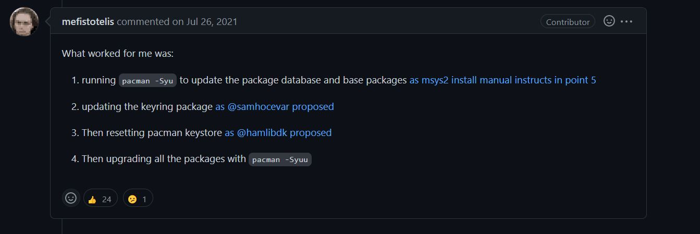

# Lab 1 - GHDL and GTKWave

## Installation

As the MSYS2 development environment was already installed on my machine I decided to directly download GHDL and GTKWave by using the MSYS install packages available from the MSYS2 website: [GHDL](https://packages.msys2.org/package/mingw-w64-x86_64-ghdl), [GTKWave](https://packages.msys2.org/package/mingw-w64-x86_64-gtkwave?repo=mingw64)

My MSYS2 install had not been updated since installation which led to install issues with GTKWave. To fix steps were followed from [this](https://github.com/msys2/MSYS2-packages/issues/2343#issuecomment-780121556) github forum. The specific steps are captured in the screenshot below:

## Half Adder
