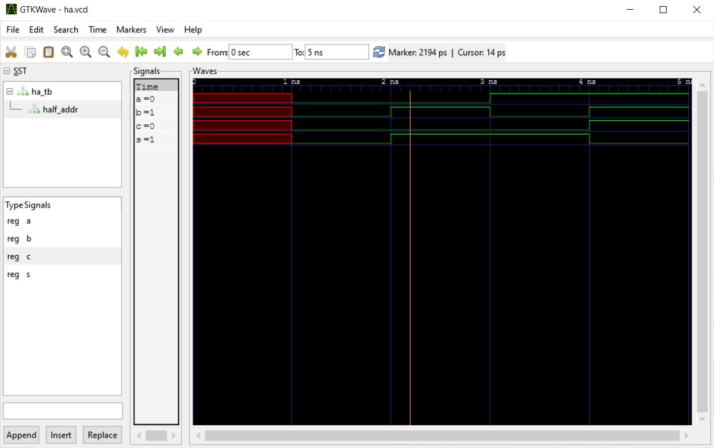
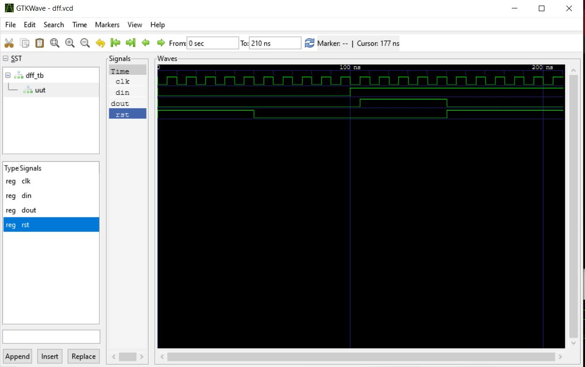

# Lab 1 - GHDL and GTKWave

## Installation

As the MSYS2 development environment was already installed on my machine I decided to directly download GHDL and GTKWave by using the MSYS install packages available from the MSYS2 website: [GHDL](https://packages.msys2.org/package/mingw-w64-x86_64-ghdl), [GTKWave](https://packages.msys2.org/package/mingw-w64-x86_64-gtkwave?repo=mingw64)

My MSYS2 install had not been updated since installation which led to install issues with GTKWave. To fix, steps were followed from [this](https://github.com/msys2/MSYS2-packages/issues/2343#issuecomment-780121556) GitHub forum. The specific steps are captured in the screenshot below:


## Notes on VHDL and GHDL

[VHDL](https://en.wikipedia.org/wiki/VHDL) stands for Very High-Speed Integrated Circuit Hardware Description Language and it is a coding language which is used to describe hardware. It can model digital systems at multiple levels of abstraction, ranging from system level to logic gates. [GHDL](http://ghdl.free.fr/) is an open source simulator for the VHDL language. It allows users to execute VHDL code directly on their pc.  

## Half Adder

Following the guide set up by Dr. Lu I inputed the following commands to execute the Half Adder example from his [dsd](https://github.com/kevinwlu/dsd/tree/master/ghdl) GitHub repository:

```bash

  $ ghdl -a ha.vhdl
  $ ghdl -a ha_tb.vhdl
  $ ghdl -e ha_tb
  $ ghdl -r ha_tb --vcd=ha.vcd
  ha_tb.vhdl:47:5:@5ns:(assertion error): Reached end of test
  $ gtkwave ha.vcd
```

The code produces the following result in GTKWave after auto adjusting the graph:



## D Flip-flop

Following the guide set up by Dr. Lu I inputed the following commands to execute the D Flip-flop example from his [dsd](https://github.com/kevinwlu/dsd/tree/master/ghdl) GitHub repository:

```bash

  ghdl -a dff.vhdl
  ghdl -a dff_tb.vhdl
  ghdl -e dff_tb
  ghdl -r dff_tb --vcd=dff.vcd
  gtkwave dff.vcd
```

The code produces the following result in GTKWave ater auto adjusting the graph:


