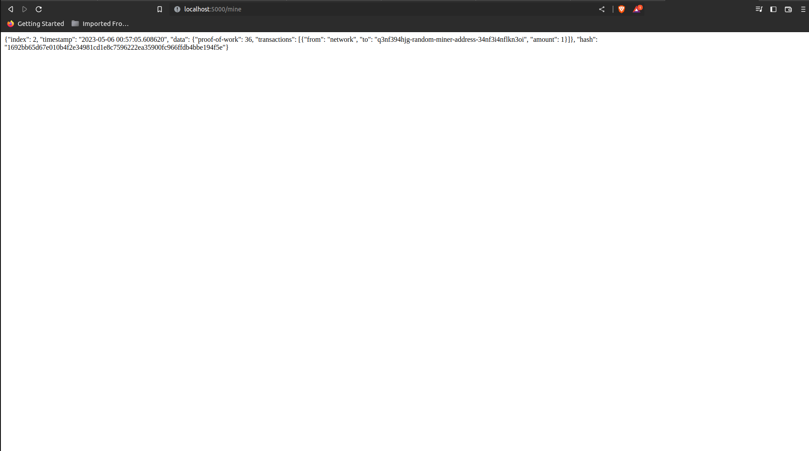
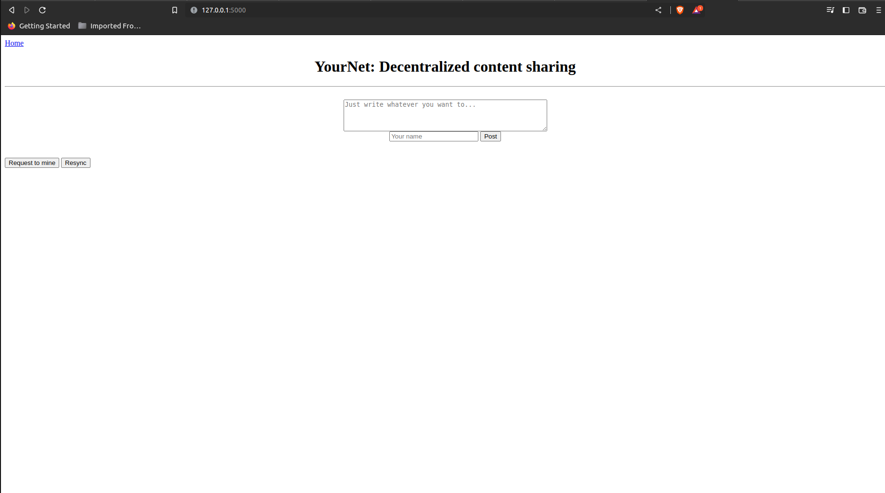
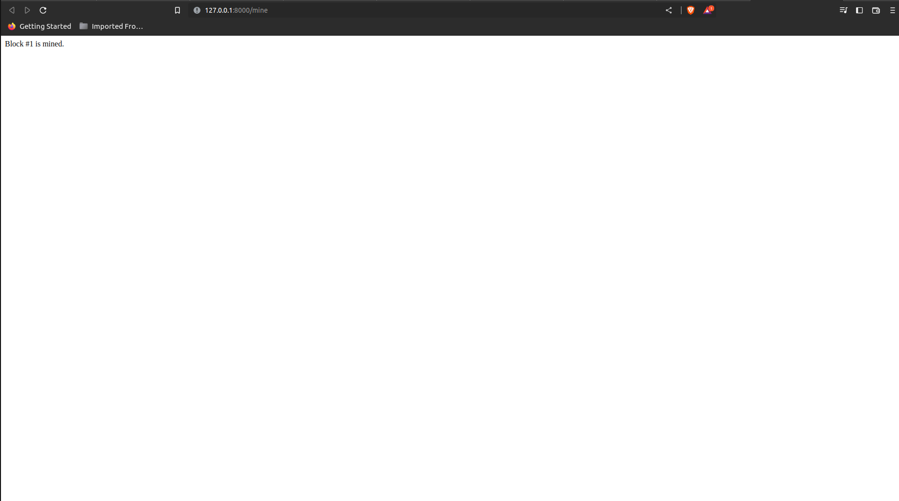
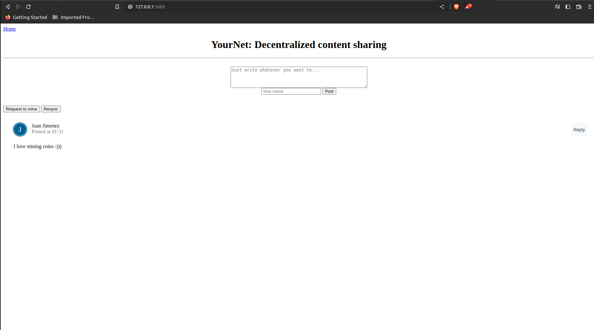

# Lab 10 - Blockchain

## Running hash_value.py twice

```bash
cd ~/iot/lesson10
jj@jj-G3-3590:~/iot/lesson10$ python3 hash_value.py
The hash for 1 is: 1
The hash for 1.0 is: 1
The hash for 3.14 is: 322818021289917443
The hash for Python is: -7959492770388936544
The hash for a tuple of vowels is: 9144202678343897225
The hash for an object of person is: -1381244028294666190
jj@jj-G3-3590:~/iot/lesson10$ python3 hash_value.py
The hash for 1 is: 1
The hash for 1.0 is: 1
The hash for 3.14 is: 322818021289917443
The hash for Python is: -5674519945145304008
The hash for a tuple of vowels is: 6525367993679323097
The hash for an object of person is: 4001915398984853762
```

## Running snakecoin.py

```bash
cd ~/iot/lesson10
jj@jj-G3-3590:~/iot/lesson10$ python3 snakecoin.py
Block #1 has been added to the blockchain!
Hash: 71267307dd9cd412c40f5e340732e0326180d80669637cba664d1825348a52c9

Block #2 has been added to the blockchain!
Hash: e5dbce8ed876e0ba04c34119688c89663c75a4af7e6bcdaa6e8b2784849a2838

Block #3 has been added to the blockchain!
Hash: cf2d60de6cb239e9244beccd445273573f986522d59a92085c951f171839e7ab

Block #4 has been added to the blockchain!
Hash: ad0b745fefeeb8f78e42caa4c550d2c9057b6b7c6bf465b0a8f00ae974e4b01a

Block #5 has been added to the blockchain!
Hash: 2a79590923e844042ab63ec4bbc32acd3a900d81c312a42666f9314eb88229d6

Block #6 has been added to the blockchain!
Hash: 4a7d39365a74f285abde2db93905416f7d0ba158181fae2102fef3d01b2953e3

Block #7 has been added to the blockchain!
Hash: 332f1c8cdd0f1cb1fc288baba869e3fcbf7cceceaefc7d1e27db05a69585d337

Block #8 has been added to the blockchain!
Hash: 01ff2ab279b983f04d01db0a07c17b002bec918711164078f1d6b6ac55ba415e

Block #9 has been added to the blockchain!
Hash: 4229572b5edcb0c3962770e107c55e73a68320901f84454f97164eff259e1e07

Block #10 has been added to the blockchain!
Hash: 9e574ee5ea8c814500d1da7a2e0e6748714766980787750b8b73f55b9144efb8

Block #11 has been added to the blockchain!
Hash: d65c8d5ba9f3a8f7d3bfb73e5fe63da25dcb4d318f544edf89e2ab114c9276a4

Block #12 has been added to the blockchain!
Hash: a401bade263de9a9c3cf5c1e87185c8035f025d4608afc1d80e33fbce794cad8

Block #13 has been added to the blockchain!
Hash: 452e7653641d445e2a3a8efa564b8e29da02f55110b3909a21621e803eb3496a

Block #14 has been added to the blockchain!
Hash: e561750aac9c58b1f0d84f4fec732f4bcbb82910d93161c04f03eaf69b7197ab

Block #15 has been added to the blockchain!
Hash: 440d4c4bafe1d05ae2523529009a66dbba114d8acf03d2f96ceb21c0cca146fb

Block #16 has been added to the blockchain!
Hash: 378a9c5d75575d2abfe761c26b12014921223ea871fb859764a0f9275c20dc13

Block #17 has been added to the blockchain!
Hash: 670a753d4bddebbfbb986ae62908be072815ec2aba2c2d367e67e20fb6fd5324

Block #18 has been added to the blockchain!
Hash: 14e85a1e2b48fe82e5b30c2686e5326f0f88956fb441162ec155f2afd8524525

Block #19 has been added to the blockchain!
Hash: 6bb05514f29cce7836c955591d3a8d30c8e95db5c6043e99a02caf2f037a7c7b

Block #20 has been added to the blockchain!
Hash: d6c624d83af947ffc670b9b50b7ce5d9f2e89f00d15b6b7c11a8c722319b362f
```

## Running snakecoin-server-full-code.py

On the first terminal you will want to execute the following commands, this will start a server as can be seen from the terminal output:

```bash
jj@jj-G3-3590:~/iot/lesson10$ python3 snakecoin-server-full-code.py
 * Serving Flask app 'snakecoin-server-full-code'
 * Debug mode: off
WARNING: This is a development server. Do not use it in a production deployment. Use a production WSGI server instead.
 * Running on http://127.0.0.1:5000
Press CTRL+C to quit
```

On the second terminal you will want to execute the following commands, to create a transaction and mine a block:

```bash
jj@jj-G3-3590:~$ curl "localhost:5000/txion" \
     -H "Content-Type: application/json" \
     -d '{"from": "akjflw", "to":"fjlakdj", "amount": 3}'
Transaction submission successful
jj@jj-G3-3590:~$ curl localhost:5000/mine
{"index": 1, "timestamp": "2023-05-06 00:55:37.142694", "data": {"proof-of-work": 18, "transactions": [{"from": "akjflw", "to": "fjlakdj", "amount": 3}, {"from": "network", "to": "q3nf394hjg-random-miner-address-34nf3i4nflkn3oi", "amount": 1}]}, "hash": "009daaf77ca83914e2cbab8fddf471833b3d50788e9b1daf23b7eb1a5f603fb0"}
```

If you connect to the server using a browser, you will see the following:



## Cloning Python Blockchain App

```bash
git clone https://github.com/satwikkansal/python_blockchain_app.git
cd ~/python_blockchain_app
```

* Before running the following commands you will want to uncomment the last line of node_server.py

On Terminal 1 run the following commmands:

```bash
jj@jj-G3-3590:~/python_blockchain_app$ python3 node_server.py
 * Serving Flask app 'node_server'
 * Debug mode: on
WARNING: This is a development server. Do not use it in a production deployment. Use a production WSGI server instead.
 * Running on http://127.0.0.1:8000
Press CTRL+C to quit
 * Restarting with stat
 * Debugger is active!
 * Debugger PIN: 134-995-385
```

On Terminal 2 run the following commands:

```bash
jj@jj-G3-3590:~/python_blockchain_app$ python3 run_app.py
 * Serving Flask app 'app'
 * Debug mode: on
WARNING: This is a development server. Do not use it in a production deployment. Use a production WSGI server instead.
 * Running on http://127.0.0.1:5000
Press CTRL+C to quit
 * Restarting with stat
 * Debugger is active!
 * Debugger PIN: 222-244-277
```

You should be able to see the following outputs on your local browser after making a request to mine a block:






