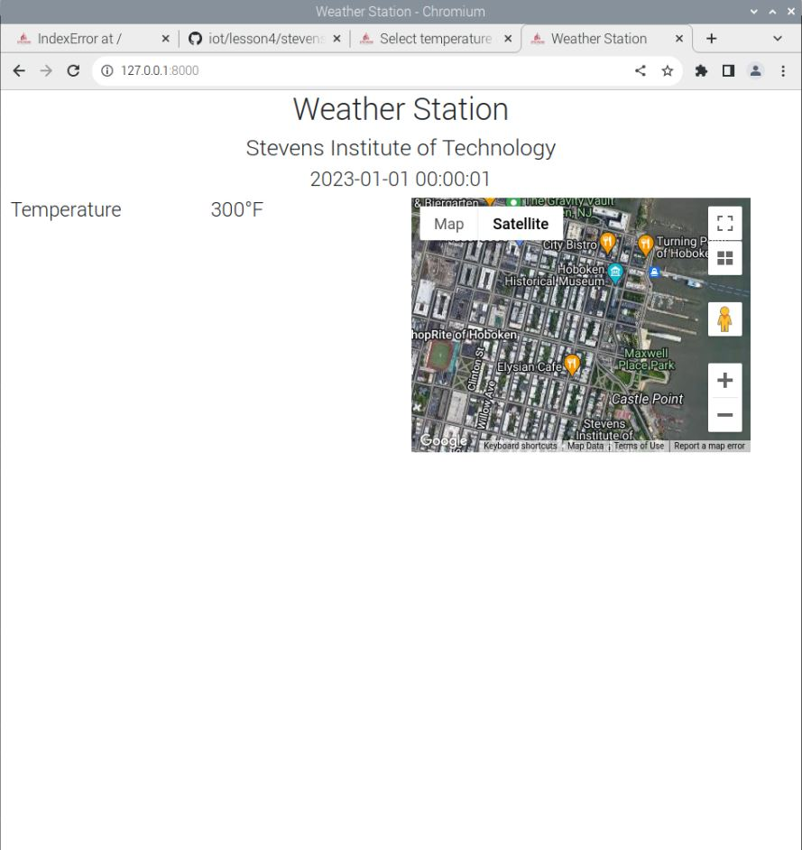

# Lab 4 - Django and Flask

## Lesson 4 Notes

Django and Flask are both open-source Python based devlepooment frameworks designed to ease code complexity for programmers. While Django is a full stack framework, Flaks is a lightweight microframework but it is also extensible. These can be used to create quick and fast web based projects.

## Lab 4 Implementation

Installation instructions can be found in [the Lesson 4 GitHub](https://github.com/kevinwlu/iot/tree/master/lesson4). The implmentation of the lab was done on a Raspberry Pi 4.

### Django Project "Stevens"

The following are the commands and outputs of running the project "Stevens":

#### Start a Django Project

```bash
jj@raspberrypi:~ $ django-admin startproject stevens
jj@raspberrypi:~ $ cd stevens
jj@raspberrypi:~/stevens $ ls
manage.py  stevens
```

#### Start a Django App

```bash
jj@raspberrypi:~/stevens $ python3 manage.py startapp myapp
jj@raspberrypi:~/stevens $ ls
manage.py  myapp  stevens
```

#### Create MySQL Database

```bash
jj@raspberrypi:~ $ sudo mysql -u root -p
Enter password: -------
MariaDB [(none)]> use mysql
MariaDB [mysql]> select user, host from mysql.user;
MariaDB [mysql]> create user jj@localhost identified by '-------';
MariaDB [mysql]> show databases;
MariaDB [mysql]> create database stevens;
MariaDB [mysql]> grant all privileges on stevens.* to jj@localhost;
MariaDB [mysql]> quit
```

#### Edit settings.py in ~/stevens/stevens

* Follow the [template](https://github.com/kevinwlu/iot/blob/master/lesson4/stevens/settings.txt) from ~/iot/lesson4/stevens/settings.txt, e.g., add an asterisk to ALLOWED_HOSTS and 'myapp' to INSTALLED_APPS.
* The comma after 'myapp' is required.
* ------ changed from MySQL user jj.
* Data was also added from databases which was missing from the settings.py file.

```bash

jj@raspberrypi:~/stevens $ cd stevens
jj@raspberrypi:~/stevens/stevens $ ls
asgi.py  __init__.py  __pycache__  settings.py  urls.py  wsgi.py
jj@raspberrypi:~/stevens/stevens $ emacs settings.py
```

#### Copy urls.py to ~/stevens/stevens

```bash
jj@raspberrypi:~/stevens/stevens $ cp ~/iot/lesson4/stevens/urls.py .
jj@raspberrypi:~/stevens/stevens $ cd ..
```

#### Copy admin.py, models.py, and views.py to ~/stevens/myapp

```bash
jj@raspberrypi:~/stevens $ cd myapp
jj@raspberrypi:~/stevens/myapp $ ls
admin.py  apps.py  __init__.py  migrations  models.py  tests.py  views.py
jj@raspberrypi:~/stevens/myapp $ cp ~/iot/lesson4/stevens/admin.py . 
jj@raspberrypi:~/stevens/myapp $ cp ~/iot/lesson4/stevens/models.py .
jj@raspberrypi:~/stevens/myapp $ cp ~/iot/lesson4/stevens/views.py .
```

#### Copy index.html

```bash
jj@raspberrypi:~/stevens/myapp $ mkdir static templates
jj@raspberrypi:~/stevens/myapp $ cd templates
jj@raspberrypi:~/stevens/myapp/templates $ mkdir myapp
jj@raspberrypi:~/stevens/myapp/templates $ cd myapp
jj@raspberrypi:~/stevens/myapp/templates/myapp $ cp ~/iot/lesson4/stevens/index.html .
```

#### Enabling Google Maps API

* In order to eneable Google Maps API you must create an account at the following [link](https://console.cloud.google.com/welcome?project=midterm-293405). After creating an account you will receive the API key neccessary to get the google maps geolocation working.

#### Copy Static Files

```bash
jj@raspberrypi:~/stevens/myapp/templates/myapp $ cd ~/stevens/myapp/static
jj@raspberrypi:~/stevens/myapp/static $ cp ~/iot/lesson4/static/favicon.ico .
jj@raspberrypi:~/stevens/myapp/static $ mkdir myapp
jj@raspberrypi:~/stevens/myapp/static $ cd myapp
jj@raspberrypi:~/stevens/myapp/static/myapp $ cp ~/iot/lesson4/static/*css .
jj@raspberrypi:~/stevens/myapp/static/myapp $ cp ~/iot/lesson4/static/*js .
jj@raspberrypi:~/stevens/myapp/static/myapp $ cd ~/stevens
```

#### After the first time, skip these three steps if no changes

```bash
jj@raspberrypi:~/stevens $ python3 manage.py makemigrations myapp 
jj@raspberrypi:~/stevens $ python3 manage.py migrate
jj@raspberrypi:~/stevens $ python3 manage.py createsuperuser
Username (leave blank to use 'jj'):
Email address: jjimene6@stevens.edu
Password: ------
Password (again): ------
Superuser created successfully.
```

#### Run the Django Project

```bash
jj@raspberrypi:~/stevens $ python3 manage.py runserver
```

#### Open the Chromium browser on Raspberry Pi via VNC Viewer

Go to <http://127.0.0.1:8000/admin>

Login with Django administration username (jj) and password.

Click temperature data to add:

* Date and time in YYYY-MM-DD HH:MM:SS.
* Temperature in Fahrenheit
* Latitude 40.7451
* Longitude -74.0255

Click SAVE.

View app at <http://127.0.0.1:8000>.

#### Working app and Output Website

If everything went succesfully the admin site should look like this:


The website should look like this after adding the appropiate data:



### Django REST Project "MyCPU"

The following include the steps taken to create the Django REST project "MyCPU".

#### Start a Django Project "MyCPU"

```bash
jj@raspberrypi:~ $ django-admin startproject mycpu
jj@raspberrypi:~ $ cd mycpu
jj@raspberrypi:~/mycpu $ ls
manage.py  mycpu
```

#### Start the "MyCPU" App

```bash
jj@raspberrypi:~/mycpu $ python3 manage.py startapp myapp
jj@raspberrypi:~/mycpu $ ls
manage.py  myapp  mycpu
```

#### Editing settings.py in ~/mycpu/mycpu

* Follow ~/iot/lesson4/mycpu/settings.txt from Dr. Lu's [GitHub repository](https://github.com/kevinwlu/iot/tree/master/lesson4/mycpu).
* The comma after 'rest_framework' is required.

```bash
jj@raspberrypi:~/mycpu $ cd mycpu
jj@raspberrypi:~/mycpu/mycpu $ ls
__init__.py  __pycache__  settings.py  urls.py  wsgi.py
jj@raspberrypi:~/mycpu/mycpu $ emacs settings.py
```

#### Copy urls.py to ~/mycpu/mycpu

```bash
jj@raspberrypi:~/mycpu/mycpu $ cp ~/iot/lesson4/mycpu/urls.py .
jj@raspberrypi:~/mycpu/mycpu $ cd ..
```

#### Copy admin.py, models.py, views.py, and serializers.py to ~/mycpu/myapp

```bash
jj@raspberrypi:~/mycpu $ cd myapp
jj@raspberrypi:~/mycpu/myapp $ ls
admin.py  apps.py  __init__.py  migrations  models.py tests.py  views.py
jj@raspberrypi:~/mycpu/myapp $ cp ~/iot/lesson4/mycpu/admin.py .
jj@raspberrypi:~/mycpu/myapp $ cp ~/iot/lesson4/mycpu/models.py .
jj@raspberrypi:~/mycpu/myapp $ cp ~/iot/lesson4/mycpu/views.py .
jj@raspberrypi:~/mycpu/myapp $ cp ~/iot/lesson4/mycpu/serializers.py .
```

#### Change the default password 'admin' in views.py

```bash
jj@raspberrypi:~/mycpu/myapp $ emacs views.py
```

#### Copy index.html "MyCPU"

```bash
jj@raspberrypi:~/mycpu/myapp $ mkdir static templates
jj@raspberrypi:~/mycpu/myapp $ cd templates
jj@raspberrypi:~/mycpu/myapp/templates $ mkdir myapp
jj@raspberrypi:~/mycpu/myapp/templates $ cd myapp
jj@raspberrypi:~/mycpu/myapp/templates/myapp $ cp ~/iot/lesson4/mycpu/index.html .
```

#### Edit inde.html to add the Gooogle Maps API key

* Simply copy the API key from the Google Maps and paste it in the index.html file.

```bash
jj@raspberrypi:~/mycpu/myapp/templates/myapp $ emacs index.html
```

#### Copy Static Files "MyCPU"

* Stevens favicon: ~/iot/lesson4/static/favicon.ico
* Xidian favicon: ~/iot/lesson4/static/xidian/favicon.ico

```bash

jj@raspberrypi:~/mycpu/myapp/templates/myapp $ cd ~/mycpu/myapp/static
jj@raspberrypi:~/mycpu/myapp/static $ cp ~/iot/lesson4/static/favicon.ico .
jj@raspberrypi:~/mycpu/myapp/static $ mkdir myapp
jj@raspberrypi:~/mycpu/myapp/static $ cd myapp
jj@raspberrypi:~/mycpu/myapp/static/myapp $ cp ~/iot/lesson4/static/*css .
jj@raspberrypi:~/mycpu/myapp/static/myapp $ cp ~/iot/lesson4/static/*js .
jj@raspberrypi:~/mycpu/myapp/static/myapp $ cd ~/mycpu
```

#### Copy controller.py to ~/mycpu

```bash
jj@raspberrypi:~/mycpu $ ls
manage.py  myapp  mycpu  static  templates
jj@raspberrypi:~/mycpu $ cp ~/iot/lesson4/mycpu/controller.py .
```

#### Change the default password 'admim' in controller.py

```bash
jj@raspberrypi:~/mycpu $ emacs controller.py
```

#### After the first time, skip these three steps if no changes for "MyCPU"

```bash
jj@rapsberrypi:~/mycpu $ python manage.py makemigrations myapp
jj@raspberrypi:~/mycpu $ python manage.py migrate
jj@raspberrypi:~/mycpu $ python manage.py createsuperuser
Username (leave blank to use '_'): admin
Email address: EMAIL_ADDRESS
Password: admin
Password (again): admin
The password is too similar to the username.
This password is too short. It must contain at least 8 characters.
This password is too common.
Bypass password validation and create user anyway? [y/N]: y
Superuser created successfully.
```

#### Run the Django Server

```bash
jj@raspberrypi:~/mycpu $ python3 manage.py runserver
```

#### Open a browser

At the first time, go to <http://127.0.0.1:8000/admin>

Login with Django administration username (admin) and password.

Click location data to add one of the following:

* Location Stevens
  * Latitude 40.7451
  * Longitude -74.0255

* Location Xidian
  * Latitude 34.2267
  * Longitude 108.9398

Click SAVE

Post the following in HTML form:

* 2022 to the Dt List at http://127.0.0.1:8000/dt
* 20 to the Cpu List at http://127.0.0.1:8000/cpu
* 20 to the Mem List at http://127.0.0.1:8000/mem

#### Run native service on a seperate terminal window

```bash
jj@raspberrypi:~/mycpu $ python3 controller.py
```

#### View app at <http://127.0.0.1:8000/home>

#### Alternatively, run Django server at 0.0.0.0:8000

```bash
jj@raspberrypi:~/mycpu $ python3 manage.py runserver 0.0.0.0:8000
```

#### Open a browser on another laptop and go to the server IP address

The following is a screenshot of my working code:


### Flask Implementation

#### Run Flask server and open a browser via VNC Viewer and go to <http://127.0.0.1:5000/>

```bash
jj@raspberrypi:~/iot/lesson4 $ python3 hello_world.py
```

#### Running Flask server locally

* By editing app.run() to "app.run(host='0.0.0.0') you can run the app on your local network.

* The following is a screenshot of my working code:
* 
