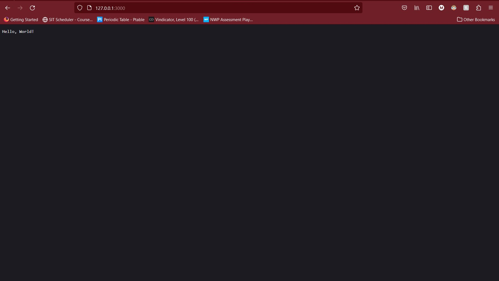

# Lab 6 - Node.js and Pystache

## Lesson 6 Notes

Node.js is a JavaScript runtime built on Chrome's V8 JavaScript engine. Node.js uses an event-driven, non-blocking I/O model that makes it lightweight and efficient. Node.js' package ecosystem, npm, is the largest ecosystem of open source libraries in the world, and is used by millions of developers. To install on my local machine I installed node.js through the MSYS installation environment. The link the installation command can be found [here](https://packages.msys2.org/package/mingw-w64-x86_64-nodejs?repo=mingw64).

## Lab 6 Implementation

### Node.js

#### hello.js

To run the first example execute the following commands:

```bash
cd ~/iot/lesson6
node hello-world.js
```

* Connect to the page at <http://127.0.0.1:8080/>.
* Refresh the page to see server activities.

You should see the following output:



#### http.js

To run the second example make sure to change the port number of 8080, to a different number in the code. In my case I changed it to 3000. Specifically change the .listen() at the end of the code to the following:

```javascript
.listen(3000);
```

To run the second example execute the following commands:

```bash
cd ~/iot/lesson6
node http.js
```

You should be able to see the following output in your terminal after refreshing the webpage located at <http://127.0.0.1:3000> in your browser:

```bash
$ node http.js
0

1
2
3
4
5
6
7
8
9
10
```

### Pystache

Pystache is a Python implementation of the Mustache templating language. It is a simple, logic-less template syntax. It can be used for HTML, config files, source code - anything. It works by expanding tags in a template using values provided in a dictionary. To install simply run the following command:

```bash
pip install pystache
```

#### hello.py

After installing Pystache you can run the say_hello.py example that uses the template in say_hello.mustache. The following is the output of the example:

```bash
Juan Jimenez@DESKTOP-JQOE2UL MINGW64 ~/iot/lesson6
$ python3 say_hello.py
Hi Alexa!
Hello, World!

['Hey ', _SectionNode(key='who', index_begin=12, index_end=18, parsed=[_EscapeNode(key='.'), '!'])]
Hey Google!
Hey Siri!
```
