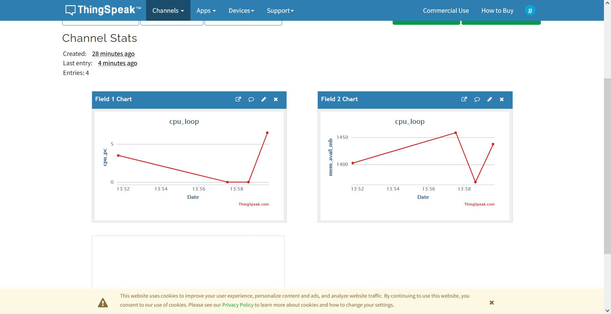
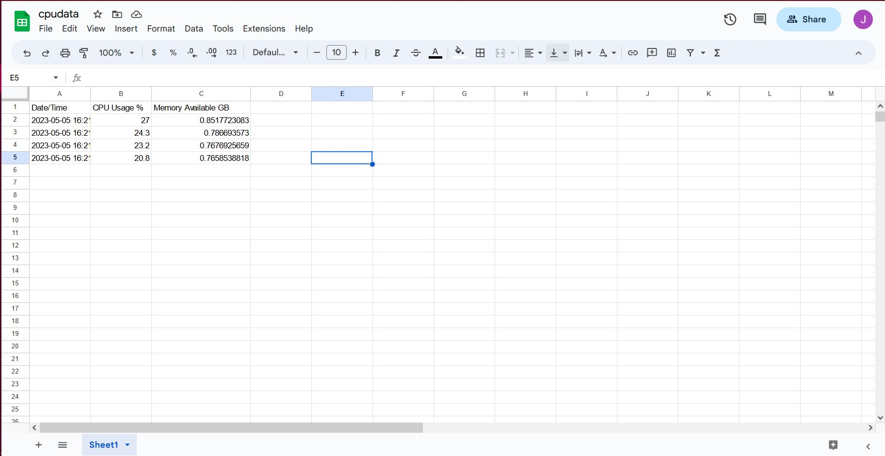

# Lab 7 - ThingSpeak and Google Sheets

## ThingSpeak

* Sign up and log into [ThingSpeak](https://thingspeak.com/) with your MathWorks account.
* Create new channel cpu_loop with field1 cpu_pc and field2 mem_avail_mb.
* Copy the Write API key from channels into thingspeak_cpu_loop.py and thingspeak_feed.py under the params variable for thingspeak_cpu_loop.py and into the API_KEY_INDEX for thingspeak_feed.py.
* Make sure you have psutil installed on your machine. If not, install it with the following command:

```bash
sudo pip3 install -U psutil
```

### Running thingspeak_cpu_loop.py and thingspeak_feedpy

```bash
$ mkdir ~/thingspeak_demo
$ cd ~/thingspeak_demo
$ cp ~/iot/lesson7/thingspeak_cpu_loop.py .
$ cp ~/iot/lesson7/thingspeak_feed.py .
$ python3 thingspeak_cpu_loop.py
An API key savefile was not found. Enter Write API Key >>>
Should we save this key for future use? [y/N] >>>
0.0
1367.7578125
Mon, 27 Mar 2023 13:58:37
200 OK
6.5
1437.73828125
Mon, 27 Mar 2023 13:59:37
200 OK
```

If you check your ThingSpeak channel on the ThingSpeak website you should see the data being updated every 60 seconds:



## Google Sheets

* The following project will use the Google Drive and Sheets API to log CPU usage into a spreadsheet.
* Make sure to install gspread and oauth2client with the following command:

```bash
sudo pip3 install -U gspread oauth2client
```

### Sign up and log in the Google Cloud Platform Identity and Access Management

* Click "Create" and enter the project name, in this case cpudata.
* ≡ > APIs & Services > + Enable APIs & Services > Enable both Drive API and Sheets API.
* Credential > Create Credentials > Create service account key > Service account > rpidata > JSON key type > Create > download cpudata-xxxxxxxxxxxx.json

### Create a demo folder and copy the following files from ~/iot/lesson7

```bash
mkdir ~/demo_cpu
cd ~/demo_cpu
cp ~/iot/lesson7/cpu_spreadsheet.py . 
```

* Make sure to copy the downloaded JSON file into the demo folder.

### Create a Google Sheet make sure to name it cpudata and share it with the client email as specified on the downloaded JSON file

* Edit the headers to include the following catagories: Date/Time, CPU %, and Memory GB

### Edit cpu_spreadsheet.py to include the name of the JSON file

### Run cpu_spreadsheet.py

Once it starts running your spreadsheet should be updated and look like this:


