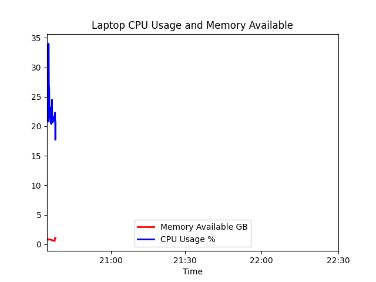
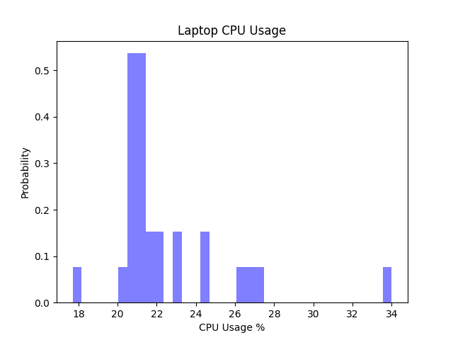
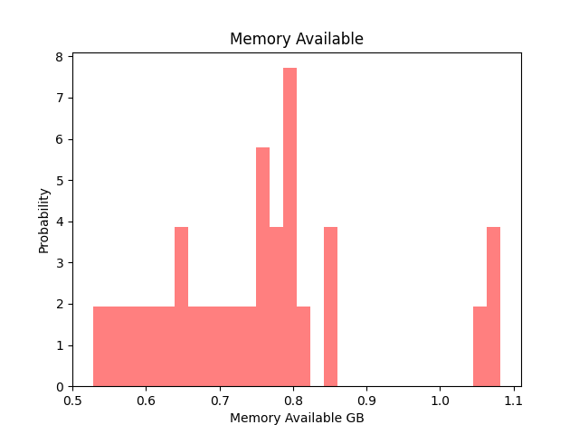
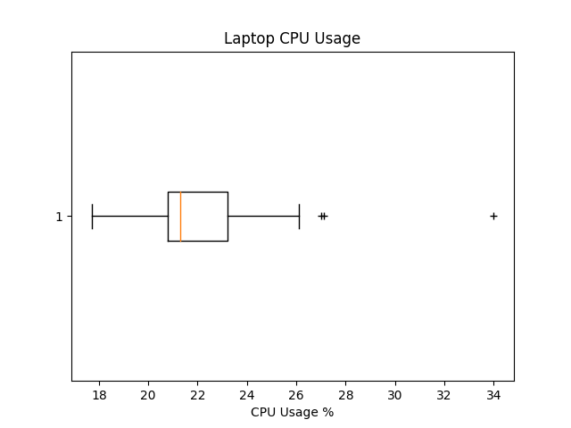
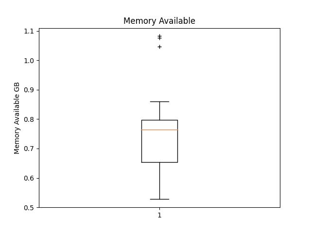
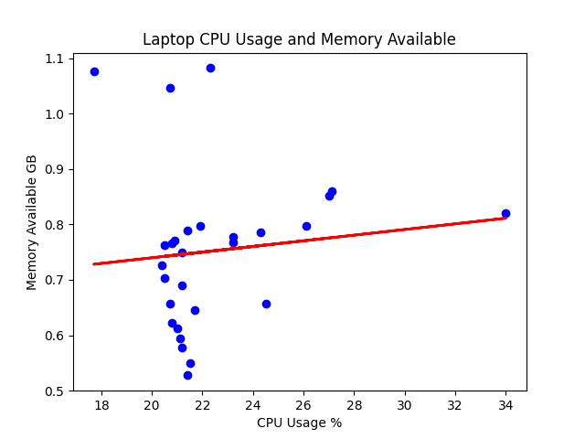
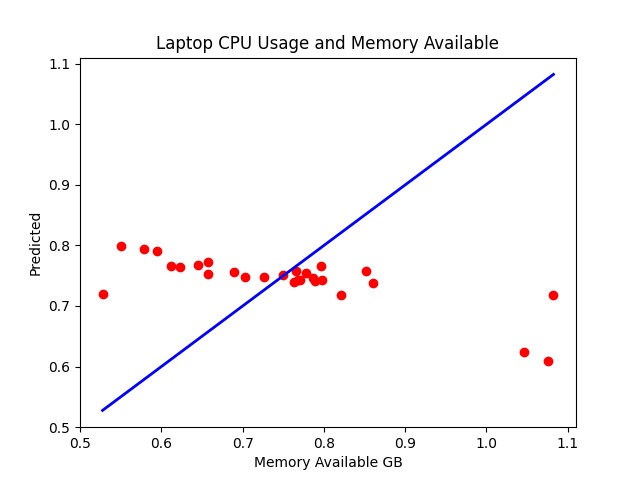

# Lab 8 Data Analysis

## Installing Python Modules

```bash
sudo pip3 install numpy scipy scikit-learn matplotlib pandas tensorflow keras
```

## Save the lab 7 Google Sheet in CSV format to ~/demo

## Copy ~/iot/lesson8/plt_final.py and plt_cv2.py to ~/demo

## Edit plt_final.py and plt_cv2.py to read the CSV file with customized plot titles

* Since last lab we didn't look at the temperature of the CPU and instead looked only into the memory available on the computer, we will not be comparing the Temperature of the CPU but instead we will compare the memory usage of the computer.
* All axis labels and titles should be changed to reflect the new data being plotted.

## Run plt_final.py and plt_cv2.py

After everything is setup correctly you should get the following plots:














