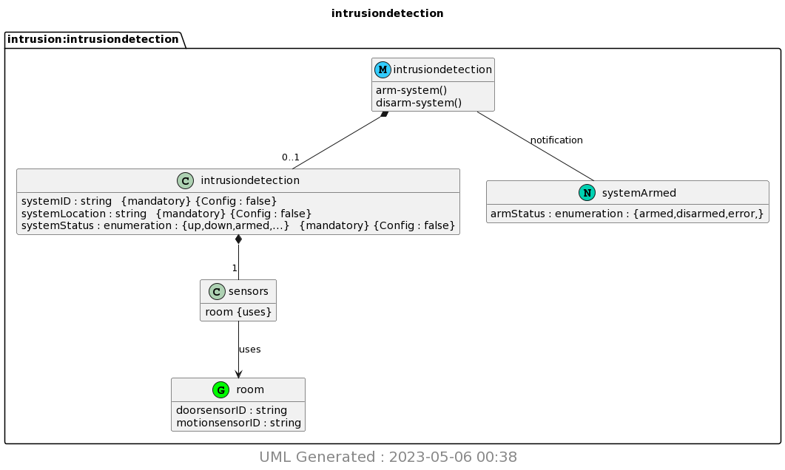

# Lab 9 - YANG

## Make sure to install pyang and PlantUML with the following command

* All of the following will be done on Ubuntu.

```bash
sudo pip3 install pyang plantuml
```

## copy ~/iot/lesson9/intrusiondetection.yang to a demo folder

## Commands to run YANG and PlantUML

```bash
pyang -f yin -o intrusiondetection.yin intrusiondetection.yang
pyang -f uml -o intrusiondetection.uml intrusiondetection.yang --uml-no=stereotypes,annotation,typedef
python3 -m plantuml intrusiondetection.uml
```

After succesfully completing the commands you should get the output of the PlantUML picture in the same folder as the intrusiondetection.yang file. The following is the output of the PlantUML picture:


